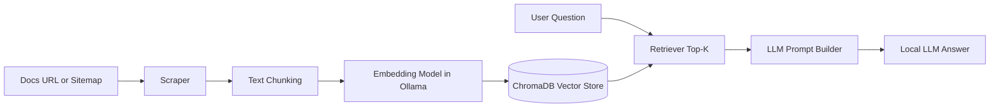

# docpilot

Ask your docs anything from your terminal using a local RAG pipeline.

`docpilot` scrapes documentation pages, chunks text, embeds it with Ollama embeddings, stores vectors in ChromaDB, and answers questions with a local LLM.

## Features

- Local-first CLI workflow (no cloud dependency required)
- Website and sitemap ingestion
- Concurrent crawler with worker controls
- Automatic config initialization at first run
- Configurable default chat and embedding models
- Chroma-backed retrieval and question answering
- Embedding fallback logic for context-length overflow (auto split and retry)

## Requirements

- Python 3.12+
- [Ollama](https://ollama.com/) installed and running
- At least one chat model and one embedding model available in Ollama

Example model setup:

```bash
ollama pull qwen2.5:latest
ollama pull mxbai-embed-large:335m
```

## Installation

### Option 1: Install as a CLI tool with uv (recommended)

From this repository root:

```bash
uv tool install .
```

Then verify:

```bash
docpilot --help
```

### Option 2: Editable install for development

```bash
python -m pip install -e .
```

## First Run Behavior

At startup, `docpilot` creates a config file if missing:

- Config file: `~/.docpilot/config.toml`

It stores defaults like:

- `default_model`
- `default_embed_model`
- `db_path`

You can change models via CLI (see below).

## Quickstart

1. List available Ollama models:

```bash
docpilot model list
```

2. Set default chat model:

```bash
docpilot model set qwen2.5:latest
```

3. Set default embedding model:

```bash
docpilot model setembed mxbai-embed-large:335m
```

4. Ingest documentation:

```bash
docpilot ingest "https://docs.python.org/3/" --workers 24 --max-pages 100
```

5. Ask questions:

```bash
docpilot ask "How do I create a virtual environment in Python?"
```

## Architecture

`docpilot` follows a standard Retrieval-Augmented Generation (RAG) pipeline:

1. Scrape docs from a website or sitemap.
2. Clean and chunk content into smaller text units.
3. Create embeddings with Ollama embedding model (for example, `mxbai-embed-large:335m`).
4. Store vectors + metadata in ChromaDB.
5. Retrieve top-k relevant chunks for a user query.
6. Send retrieved context to a local LLM and generate the final answer.



## Interview Notes

Use this short version in interviews:

- "DocPilot is a local-first RAG CLI for documentation Q and A."
- "It ingests docs by scraping pages, chunking text, embedding with Ollama, and storing vectors in ChromaDB."
- "At query time it retrieves semantically relevant chunks and feeds them to a local LLM for grounded answers."
- "I added concurrency controls for faster ingestion and robust overflow handling by auto-splitting oversized embedding inputs."

If asked about design decisions:

- Why local-first:
	Better privacy, no external API dependency, and predictable cost.
- Why vector search:
	Semantic retrieval works better than keyword-only search across large docs.
- Why chunking:
	Keeps context focused and improves retrieval quality.
- Why overflow handling:
	Prevents ingest failure when model context limits are exceeded.

If asked about trade-offs:

- Higher `k` improves recall but can increase prompt size and latency.
- Aggressive chunking improves fit but may lose long-range context.
- More workers increase throughput but can stress network/host resources.

## CLI Commands

### `docpilot ingest SOURCE`

Ingest web docs from a site URL or a sitemap.

Options:

- `--max-pages`, `-p` (default: `20`): max pages to crawl for website mode
- `--workers`, `-w` (default: `16`): concurrent scraping workers

Examples:

```bash
docpilot ingest "https://docs.python.org/3/" --workers 24 --max-pages 50
docpilot ingest "https://example.com/sitemap.xml" --workers 24
```

### `docpilot ask QUESTION`

Query the ingested knowledge base.

```bash
docpilot ask "What is asyncio.gather used for?"
```

### `docpilot model ACTION [MODEL_NAME]`

Model management:

- `list`: list models from Ollama
- `set <model>`: set default chat model
- `setembed <model>`: set default embedding model

Examples:

```bash
docpilot model list
docpilot model set qwen2.5:latest
docpilot model setembed mxbai-embed-large:335m
```

## Notes on Performance and Stability

- Scraping is concurrent and tunable via `--workers`.
- If an embedding request exceeds model context length, ingestion now retries by splitting chunks automatically.
- Chat retrieval context is bounded before prompt construction to reduce prompt-overflow failures.

## Troubleshooting

- `No such option: --workers`
	- Reinstall the current local package:

```bash
uv tool install .
```

- Ollama model not found
	- Run `docpilot model list` and set an available model.

- Empty answers after ingest
	- Ensure ingest completed successfully and vectors were written to the configured `db_path`.

## License

MIT License. See [LICENSE](LICENSE).
